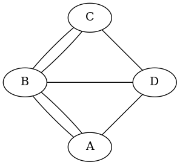

# Maximally Eulerian Rectangular Mazes

## Contents

* Section 1. Background
* Section 2. The problem
* Section 3. Grids with even dimensions
* Section 4. Grids with one odd dimension
* Section 5. Both dimensions odd
* Section 6. Verification
* Section 7. For further study

## Section 1. Background

A maze is Eulerian if and only if it has a closed walk which traverses every passage exactly once.  (A walk is closed if it starts and ends in the same vertex.  An Eulerian tour is a closed walk in which each passage appears exactly once.)  The ideas started with a puzzle posed by Christian Goldbach to Leonhard Euler -- Euler proposed his solution in 1735, published in a paper entitled "Solutio problematis ad geometriam situs pertinentis".[^1]

[^1] Leonhard Euler (1707-1783). "Solutio problematis ad geometriam situs pertinentis" in *Commentarii Academiae Scientiarum Petropolitanae*.  1741. *pp* 128-140. (Enestrom E53)

<div style="text-align: center;">
  <br />
  <span style="font-variant: small-caps;">Figure</span> 1. The Königsberg bridges (1735).
</div>

The problem posed by Goldbach is summarized in Figure 1.  The River Pregel passes through city of Königsberg, Prussia (now Kalingrad in Russia).  In the diagram, land masses A and C form the banks of the River Pregel, and the river has two large islands B and D.  The edges in the graph represent bridges over the river.  According to Goldbach, citizens of Königsberg would take Sunday walks and attempt to cross each bridge exactly once, but no one had come up with such a walk.

What Euler showed was that such a walk was actually impossible.  In the course of his proof, he uncovered a new branch of mathematics which he called *geometria situs* (geometry of location -- Euler attributed the name to Leibniz).  Today that branch has become two separate branches, namely topology (a mix of geometry, algebra, and analysis) and graph theory (a branch of combinatorics).

The land masses on the map are now known as vertices or nodes in a graph (or cells in a maze), while the bridges are typically thought of as edges (or passages).  The *degree* of a land mass (vertex/node/cell) is the number of incident bridges (edges/passages).  For example, the degrees of vertices A, C, and D in the Figure are all 3, while the degree of vertex B is 5.

If we suppose that someone had actually discovered a walk of the sort described by Goldbach, then we could assign a direction to each bridge.  In order to return to the start vertex, each vertex would need to be reached an even number of times.  But in this configuration, each land mass has an odd number of bridges, so an Eulerian tourC is impossible.

Euler also noted that even if one were allowed to start and end in different places, the walk would be impossible.  If someone were to find such a walk, then draw a new edge from finish to start to form an Eulerian cycle.  But we still have two odd vertices, so such a walk is likewise impossible.

Euler conjectured but did not prove the converse, that a connected graph in which every vertex is even has an Eulerian tour.  That part was completed by Carl Hierholzer (1840-1871) and published posthumously in 1873.  By removing one edge in the tour we obtain an Eulerian trail (an open walk with each edge appearing once) -- a connected graph with exactly two odd edges has an Eulerian trail, and every Eulerian trail starts in an odd vertex and ends in the other odd vertex.

A useful lemma (also due to Euler) is the following theorem:

* **Lemma (Euler)** The sum of the degrees of the vertices in a graph is equal to twice the number of edges.

The proof is simple.  If we assign direction to each edge, then each edge is counted twice, once leaving a vertex, and a second time entering a vertex.  (Loops are accordingly counted as a double edge.)

As a corollary, we have:

* **Corollary (Euler)** The number of odd vertices in a graph is even.

## Section 2. The problem

Given a connected graph, is there a subgraph which is Eulerian?  If the answer is affirmative, find an Eulerian subgraph which is maximal in the following sense:

* The given Eulerian subgraph has at least as many edges as any Eulerian subgraph.

But facets of this problem are apparently very hard (in the sense that the problem apparently has no known complete deterministic polynomial time solution).  So there is a bit of bait and switch here...

What we actually provide here are some particular solutions for Von Neumann grids.

## Section 3. Grids with even dimensions

The easiest case consists of grids with both an even number of rows and an even number of columns.  Here we note that, along the border, every cell must have exactly two incident passages.  We can make every interior cell have four incident passages by letting every other border cell have a passage leading into the interior.  (A corner has only two possible edges, so we're force to use both.)

Here is the smallest example, four corner cells and no internal cells:
```
    $ python -m demos.maximally_eulerian -d 2 2
    Namespace(dim=[2, 2], no_constraints=False)
    make_maze(rows=2, cols=2, constrain=True)
    +---+---+
    |       |
    +   +   +
    |       |
    +---+---+
```

We can extend this simple circuit in one direction to get another simple circuit:
```
    $ python -m demos.maximally_eulerian -d 2 6 -N
    Namespace(dim=[2, 6], no_constraints=False)
    make_maze(rows=2, cols=6, constrain=True)

    +---+---+---+---+---+---+
    |                       |
    +   +---+---+---+---+   +
    |                       |
    +---+---+---+---+---+---+
```

Extending the columns is similar:
```
    $ python -m demos.maximally_eulerian -d 6 2 -N
    Namespace(dim=[6, 2], no_constraints=False)
    make_maze(rows=2, cols=6, constrain=True)

    +---+---+
    |       |
    +   +   +
    |   |   |
    +   +   +
    |   |   |
    +   +   +
    |   |   |
    +   +   +
    |   |   |
    +   +   +
    |       |
    +---+---+
```

Extending simultaneously in both directions is more interesting:
```
    python -m demos.maximally_eulerian -d 4 8
    Namespace(dim=[4, 8], no_constraints=False)
    make_maze(rows=4, cols=8, constrain=True)
    +---+---+---+---+---+---+---+---+
    |       |       |       |       |
    +   +   +   +   +   +   +   +   +
    |                               |
    +---+   +   +   +   +   +   +---+
    |                               |
    +   +   +   +   +   +   +   +   +
    |       |       |       |       |
    +---+---+---+---+---+---+---+---+
```
All the interior cells are saturated, but the boundary cells are paired.  Notice that removal of any wall would result in two degree-3 cells.

## Section 4. Grids with one odd dimension

The situation gets more interesting when we have an odd dimension.  Convince yourself that there is no Eulerian maze in a grid with 1 row and an even number of columns.

If the even dimension is two, a simple circuit is the best that we can do:
```
    $ python -m demos.maximally_eulerian -d 2 5
    Namespace(dim=[2, 5], no_constraints=False)
    make_maze(rows=2, cols=5, constrain=True)
    +---+---+---+---+---+
    |                   |
    +   +---+---+---+   +
    |                   |
    +---+---+---+---+---+
```

I think we have a problem when one dimension is three and the other is even and larger than two.  We'll use the -N flag to avoid the *ValueError* exception:
```
    $ python -m demos.maximally_eulerian -d 3 4 -N
    Namespace(dim=[3, 4], no_constraints=True)
    make_maze(rows=3, cols=4, constrain=False)
    (WARNING) OddEven: cannot construct Eulerian m=3 and n=4>2
    +---+---+---+---+
    |       |       |
    +   +   +   +   +
    |   |   |   |   |
    +   +   +   +   +
    |       |       |
    +---+---+---+---+
```
Notice that we cannot remove first or the third wall in the second row as that would give us a degree-3 cell on the boundary.  The second wall in the second row can't be removed without removing the other two.

But the odd dimension can certainly be five or more:
```
    $ python -m demos.maximally_eulerian -d 5 8
    Namespace(dim=[5, 8], no_constraints=False)
    make_maze(rows=5, cols=8, constrain=True)
    +---+---+---+---+---+---+---+---+
    |       |       |       |       |
    +   +   +   +   +   +   +   +   +
    |                               |
    +---+   +   +   +   +   +   +---+
    |                               |
    +   +   +   +   +   +   +   +   +
    |   |   |   |   |   |   |   |   |
    +   +   +   +   +   +   +   +   +
    |       |       |       |       |
    +---+---+---+---+---+---+---+---+
```
The solution is to group boundary items in two along the even boundary and one of the odd boundaries, and in threes along the other odd boundary.  Here we have a similar situation with the roles reversed:
```
    python -m demos.maximally_eulerian -d 6 9
    Namespace(dim=[6, 9], no_constraints=False)
    make_maze(rows=6, cols=9, constrain=True)
    +---+---+---+---+---+---+---+---+---+
    |           |       |       |       |
    +   +---+   +   +   +   +   +   +   +
    |                                   |
    +---+---+   +   +   +   +   +   +---+
    |                                   |
    +   +---+   +   +   +   +   +   +   +
    |                                   |
    +---+---+   +   +   +   +   +   +---+
    |                                   |
    +   +---+   +   +   +   +   +   +   +
    |           |       |       |       |
    +---+---+---+---+---+---+---+---+---+
```

## Section 5. Both dimensions odd

The trivial case is m=n=1:
```
    $ python -m demos.maximally_eulerian -d 1 1
    Namespace(dim=[1, 1], no_constraints=False)
    make_maze(rows=1, cols=1, constrain=True)
    +---+
    |   |
    +---+
```
Here there is one cell with no incident passages.  We have an Eulerian tour which is not a circuit.  (Circuits are dependent sets.  A set with no edges is not dependent.)

We can't have one row with more than one column, or one column with more than one row.  In either case we cannot produce a tour.

We cannot produce a 3x3 Eulerian tour:
```
    $ python -m demos.maximally_eulerian -d 3 3 -N
    Namespace(dim=[3, 3], no_constraints=True)
    make_maze(rows=3, cols=3, constrain=False)
    (WARNING) OddOdd: cannot construct Eulerian m=3 and n=3
    +---+---+---+
    |           |
    +   +   +   +
    |   |       |
    +   +---+   +
    |           |
    +---+---+---+
```
We do get a connected maze with two odd cells.  It has an Eulerian trail, but no Eulerian tour.

Adding more rows or more columns or both makes it possible to produce an Eulerian tour.  Here is a simplest example:
```
    $ python -m demos.maximally_eulerian -d 3 5
    Namespace(dim=[3, 5], no_constraints=False)
    make_maze(rows=3, cols=5, constrain=True)
    +---+---+---+---+---+
    |       |           |
    +   +   +   +---+   +
    |   |           |   |
    +   +---+   +   +   +
    |           |       |
    +---+---+---+---+---+
```
(Try the demo with 5 rows and 3 columns to get the other simplest example.)

And here is a more complicated example.  The pattern should be apparent:
```
    $ python -m demos.maximally_eulerian -d 7 11
    Namespace(dim=[7, 11], no_constraints=False)
    make_maze(rows=7, cols=11, constrain=True)
    +---+---+---+---+---+---+---+---+---+---+---+
    |       |       |       |       |           |
    +   +   +   +   +   +   +   +   +   +---+   +
    |                                       |   |
    +---+   +   +   +   +   +   +   +   +   +   +
    |                                           |
    +   +   +   +   +   +   +   +   +   +   +---+
    |                                           |
    +---+   +   +   +   +   +   +   +   +   +   +
    |                                           |
    +   +   +   +   +   +   +   +   +   +   +---+
    |   |                                       |
    +   +---+   +   +   +   +   +   +   +   +   +
    |           |       |       |       |       |
    +---+---+---+---+---+---+---+---+---+---+---+
```

## Section 6. Verification

### 6.1 Connectivity

A necessary (but insufficient) condition for a maze to be Eulerian is that it must be connected.  This can be checked using depth-first search (or, for that matter, any queue-based search that works for a growing tree algorithm.)

Let's look at a few examples.  First we need some imports.  We will use
the function *maximally_Eulerian* to create the mazes. (This is the function used in the demo module that we used for examples in the previous three sections).

We also need a connectivity checker.  The function *is_connected* in module *mazes.eulerian* uses depth-first search (*i.e.*, LIFO search) and maintains a few statistics that can be used as diagnostics.  (The statistics are maintained in a namespace called *connectivity*.)

We start by running the Python interpreter and importing the tools that we need:
```
    $ python
    >>> from mazes.Grids.eulerian_oblong import maximally_Eulerian
    >>> from mazes.eulerian import is_connected, connectivity
```

Now let's create an Eulerian maze:
```
    >>> maze = maximally_Eulerian(8, 13)
    >>> print(maze)
    +---+---+---+---+---+---+---+---+---+---+---+---+---+
    |           |       |       |       |       |       |
    +   +---+   +   +   +   +   +   +   +   +   +   +   +
    |                                                   |
    +---+---+   +   +   +   +   +   +   +   +   +   +---+
    |                                                   |
    +   +---+   +   +   +   +   +   +   +   +   +   +   +
    |                                                   |
    +---+---+   +   +   +   +   +   +   +   +   +   +---+
    |                                                   |
    +   +---+   +   +   +   +   +   +   +   +   +   +   +
    |                                                   |
    +---+---+   +   +   +   +   +   +   +   +   +   +---+
    |                                                   |
    +   +---+   +   +   +   +   +   +   +   +   +   +   +
    |           |       |       |       |       |       |
    +---+---+---+---+---+---+---+---+---+---+---+---+---+
```

Let's verify that it is connected and check the performance statistics for depth-first search:
```
    >>> is_connected(maze)
    True
    >>> print(connectivity)
    Statistics
    	                 maximum stack	        29
    	                         cells	       104
    	                       reached	       104
```
All 104 cells were reached (8 times 13 is 104).  The stack contained a maximum of 29 cells at any time.

We can produce certain bad examples by setting the *constrain* option to False.  (With the default *True*, setting the number of rows and columns to certain bad values results in a ValueError exception.)  With three rows and an even number of columns exceeding 2, we get a disconnected maze.
```
    >>> bad_maze = maximally_Eulerian(3, 8, constrain=False)
    (WARNING) OddEven: cannot construct Eulerian m=3 and n=8>2
    >>> print(bad_maze)
    +---+---+---+---+---+---+---+---+
    |       |       |       |       |
    +   +   +   +   +   +   +   +   +
    |   |   |   |   |   |   |   |   |
    +   +   +   +   +   +   +   +   +
    |       |       |       |       |
    +---+---+---+---+---+---+---+---+
```
Note that we have four connected components covering two columns each.  Here is the automated check:
```
    >>> is_connected(bad_maze)
    False
    >>> print(connectivity)
    Statistics
    	                 maximum stack	         2
    	                         cells	        24
    	                       reached	         6
```
The search started in some random cell and the search reached just one fourth of the cells before failing.

Another problem case is the 3x3 grid.  But in this case, we do get a connected maze -- it just happens not to be Eulerian.  Again we turn off the *constrain* flag to indicate that we know what we're doing.  A warning is displayed, just in case, but no exception is raised:
```
    >>> bad_maze2 = maximally_Eulerian(3, 3, constrain=False)
    (WARNING) OddOdd: cannot construct Eulerian m=3 and n=3
    >>> print(bad_maze2)
    +---+---+---+
    |           |
    +   +   +   +
    |   |       |
    +   +---+   +
    |           |
    +---+---+---+
    >>> is_connected(bad_maze2)
    True
    >>> print(connectivity)
    Statistics
    	                 maximum stack	         3
    	                         cells	         9
    	                       reached	         9
```
The maze is connected -- all nine cells were reached by depth-first search.

### 6.2 Euler's degree condition

A sufficient and necessary condition for a *connected* maze to be Eulerian is that every one ot its cells must be even (in degree), *i.e.* the number of incident passages (not counting *loops*) must be even.  (REMINDER: A loop is a passage which starts and ends in a single cell.  Loops are circuits of length 1.  *An Eulerian tour must traverse every loop in a maze!*)

Module *mazes.eulerian* contains two degree checking methods: *is_Eulerian* and *is_path_Eulerian*.  Both run the *is_connected* method by default -- if the maze is disconnected, a DisconnectedMaze exception (defined in the module) is raised.

We will use our 8x13 Eulerian maze for our example.  We need two imports:
```
    >>> from mazes.eulerian import is_Eulerian, is_path_Eulerian
```

We display the maze (from before) and then run the checks:
```
    >>> print(maze)
    +---+---+---+---+---+---+---+---+---+---+---+---+---+
    |           |       |       |       |       |       |
    +   +---+   +   +   +   +   +   +   +   +   +   +   +
    |                                                   |
    +---+---+   +   +   +   +   +   +   +   +   +   +---+
    |                                                   |
    +   +---+   +   +   +   +   +   +   +   +   +   +   +
    |                                                   |
    +---+---+   +   +   +   +   +   +   +   +   +   +---+
    |                                                   |
    +   +---+   +   +   +   +   +   +   +   +   +   +   +
    |                                                   |
    +---+---+   +   +   +   +   +   +   +   +   +   +---+
    |                                                   |
    +   +---+   +   +   +   +   +   +   +   +   +   +   +
    |           |       |       |       |       |       |
    +---+---+---+---+---+---+---+---+---+---+---+---+---+
    >>> is_Eulerian(maze)
    True
    >>> is_path_Eulerian(maze)
    False
```

It is connected and all its cells are even.  It is Eulerian and not path-Eulerian.  But we can make it path-Eulerian by removing a single passage (as long as it isn't a loop).  Let's choose this passage randomly:
```
    >>> from mazes import rng
    >>> passages = list(maze)
    >>> len(passages)
    164
    >>> join = rng.choice(passages)
```

Let's label the two endpoints that we found:
```
    >>> cell1, cell2 = join
    >>> (cell1.index, cell2.index)
    ((4, 11), (4, 10))
    >>> cell1.label = "A"
    >>> cell2.label = "B"
```

Now we display the maze with the labelled cells:
```
    >>> print(maze)
    +---+---+---+---+---+---+---+---+---+---+---+---+---+
    |           |       |       |       |       |       |
    +   +---+   +   +   +   +   +   +   +   +   +   +   +
    |                                                   |
    +---+---+   +   +   +   +   +   +   +   +   +   +---+
    |                                                   |
    +   +---+   +   +   +   +   +   +   +   +   +   +   +
    |                                         B | A     |
    +---+---+   +   +   +   +   +   +   +   +   +   +---+
    |                                                   |
    +   +---+   +   +   +   +   +   +   +   +   +   +   +
    |                                                   |
    +---+---+   +   +   +   +   +   +   +   +   +   +---+
    |                                                   |
    +   +---+   +   +   +   +   +   +   +   +   +   +   +
    |           |       |       |       |       |       |
    +---+---+---+---+---+---+---+---+---+---+---+---+---+
```

And finally we check the result:
```
    >>> is_Eulerian(maze)
    False
    >>> is_path_Eulerian(maze)
    [<SquareCell object>, <SquareCell object>]
```

The *is_path_Eulerian* checker returned our two odd cells -- let's take a closer look:
```
    >>> cell1. cell2 = is_path_Eulerian(maze)
    >>> (cell1.label, cell2.label)
    ('A', 'B')
```
Correct!

If we simply wanted a True/False answer, we could use the *bool* class wrapper:
```
    >>> bool(is_path_Eulerian(maze))
    True
```

Now let's use the *is_path_Eulerian* function to diagnose the 3x3 maze from earlier.  Here is the maze:
```
    >>> maze = maximally_Eulerian(3, 3, constrain=False)
    (WARNING) OddOdd: cannot construct Eulerian m=3 and n=3
    >>> print(maze)
    +---+---+---+
    |           |
    +   +   +   +
    |   |       |
    +   +---+   +
    |           |
    +---+---+---+
```

Let's label the odd vertices:
```
    >>> cell1, cell2 = is_path_Eulerian(maze)
    >>> cell1.label = "A"
    >>> cell2.label = "B"
    >>> print(maze)
    +---+---+---+
    |     B     |
    +   +   +   +
    |   |     A |
    +   +---+   +
    |           |
    +---+---+---+
```

### 6.3 Maximally Eulerian

We can check whether a maze is maximally Euclidean in the following sense:

* there is no circuit if the grid-relative complement of the maze.

Let's start with a one of our examples from before:

```
    $ python
    >>> from mazes.Grids.eulerian_oblong import maximally_Eulerian
    >>> maze = maximally_Eulerian(8, 13)
    >>> print(maze)
    +---+---+---+---+---+---+---+---+---+---+---+---+---+
    |           |       |       |       |       |       |
    +   +---+   +   +   +   +   +   +   +   +   +   +   +
    |                                                   |
    +---+---+   +   +   +   +   +   +   +   +   +   +---+
    |                                                   |
    +   +---+   +   +   +   +   +   +   +   +   +   +   +
    |                                                   |
    +---+---+   +   +   +   +   +   +   +   +   +   +---+
    |                                                   |
    +   +---+   +   +   +   +   +   +   +   +   +   +   +
    |                                                   |
    +---+---+   +   +   +   +   +   +   +   +   +   +---+
    |                                                   |
    +   +---+   +   +   +   +   +   +   +   +   +   +   +
    |           |       |       |       |       |       |
    +---+---+---+---+---+---+---+---+---+---+---+---+---+
```

In module *mazes.eulerian*, there is a function *not_maximally_Eulerian* which returns *None* if a maze is maximally Eulerian, *i.e.* (a) it is connected, (b) it is Eulerian, and (c) it is maximal in the sense that the grid-complement of the maze has no simple circuits.  (Determining whether one can find an Eulerian maze with more passages is a harder problem.)  If (a) or (b) fails, then an exception is raised.  If (c) fails, the function returns the cells that form the missing circuit.  If we wrap the call in the *bool* class method, then *True* tells us that a circuit was found and *False* tells us that condition (c) was satisfied.

As a depth-first search is used to attempty find a background circuit, statistics are kept in a namespace which is named *maximality*.
```
    >>> from mazes.eulerian import not_maximally_Eulerian, maximality
    >>> status = not_maximally_Eulerian(maze)
    >>> bool(status)
    False
    >>> print(maximality)
    Statistics
    	                 maximum stack	         6
    	                         cells	        40
    	                       reached	        40
```
The returned status was *None*.  So the maze is maximally Eulerian in the sense described above.

DFS used a maximum of six stack entries.  (Each entry consisted of a pair of cells in the maze.)  Forty cells had background grid edges (*i.e.* grid edges which were not used as passages in the maze.

Now let us remove a circuit from the maze.  It will still be Eulerian, but it won't be maximally Eulerian.
```
    >>> cell = maze.grid[3,5]; cell.label = "X"
    >>> maze.unlink(cell.join_for(cell.east))
    >>> maze.unlink(cell.join_for(cell.north))
    >>> maze.unlink(cell.east.join_for(cell.east.north))
    >>> maze.unlink(cell.north.join_for(cell.north.east))
    >>> print(maze)
    +---+---+---+---+---+---+---+---+---+---+---+---+---+
    |           |       |       |       |       |       |
    +   +---+   +   +   +   +   +   +   +   +   +   +   +
    |                                                   |
    +---+---+   +   +   +   +   +   +   +   +   +   +---+
    |                                                   |
    +   +---+   +   +   +   +   +   +   +   +   +   +   +
    |                       |                           |
    +---+---+   +   +   +---+---+   +   +   +   +   +---+
    |                     X |                           |
    +   +---+   +   +   +   +   +   +   +   +   +   +   +
    |                                                   |
    +---+---+   +   +   +   +   +   +   +   +   +   +---+
    |                                                   |
    +   +---+   +   +   +   +   +   +   +   +   +   +   +
    |           |       |       |       |       |       |
    +---+---+---+---+---+---+---+---+---+---+---+---+---+
```
The missing circuit consists of the four grid edges that were remove.  The incident cells are the cell labelled *X*, its neighbors north and east, and the
cell diagonally immediate to the northeast.

```
>>> status = not_maximally_Eulerian(maze)
>>> bool(status)
True
>>> print(maximality)
Statistics
	                 maximum stack	         5
	                         cells	        44
	                       reached	        18
```
The search picks random starting points,  If it happens to first start in the circuit, only four cells would be reached.  Here it made a number of false starts in background components that were circuit-free.

Now let us verify the circuit by adding it back in and labelliing the cells:
```
    >>> for i in range(len(status)-1):
    ...    cell, nbr = status[i], status[i+1]
    ...    cell.label = "ABCD"[i]
    ...    maze.link(cell, nbr)
    ...
    >>> print(maze)
    +---+---+---+---+---+---+---+---+---+---+---+---+---+
    |           |       |       |       |       |       |
    +   +---+   +   +   +   +   +   +   +   +   +   +   +
    |                                                   |
    +---+---+   +   +   +   +   +   +   +   +   +   +---+
    |                                                   |
    +   +---+   +   +   +   +   +   +   +   +   +   +   +
    |                     D   C                         |
    +---+---+   +   +   +   +   +   +   +   +   +   +---+
    |                     A   B                         |
    +   +---+   +   +   +   +   +   +   +   +   +   +   +
    |                                                   |
    +---+---+   +   +   +   +   +   +   +   +   +   +---+
    |                                                   |
    +   +---+   +   +   +   +   +   +   +   +   +   +   +
    |           |       |       |       |       |       |
    +---+---+---+---+---+---+---+---+---+---+---+---+---+
```

### 6.4 Maximally path-Eulerian

We can handle the path-Eulerian case using an option.  Let's start fresh:
```
    $ python
    >>> from mazes.Grids.eulerian_oblong import maximally_Eulerian
    >>> maze = maximally_Eulerian(8, 13)
    >>> from mazes import rng
    >>> join = rng.choice(list(maze))
    >>> maze.unlink(join)
    >>> print(maze)
    +---+---+---+---+---+---+---+---+---+---+---+---+---+
    |           |       |       |       |       |       |
    +   +---+   +   +   +   +   +   +   +   +   +   +   +
    |                                                   |
    +---+---+   +   +   +   +   +   +   +   +   +   +---+
    |                                                   |
    +   +---+   +   +   +   +   +   +   +   +   +   +   +
    |                                                   |
    +---+---+   +   +   +   +---+   +   +   +   +   +---+
    |                                                   |
    +   +---+   +   +   +   +   +   +   +   +   +   +   +
    |                                                   |
    +---+---+   +   +   +   +   +   +   +   +   +   +---+
    |                                                   |
    +   +---+   +   +   +   +   +   +   +   +   +   +   +
    |           |       |       |       |       |       |
    +---+---+---+---+---+---+---+---+---+---+---+---+---+
```
We removed a randomly chosen passage.  We now have two cells of odd degree.  The maze is no longer Eulerian:
```
    >>> from mazes.eulerian import not_maximally_Eulerian, maximality
    >>> status = not_maximally_Eulerian(maze)
    (Exception raised):
    mazes.eulerian.NonEulerian: The maze is not Eulerian
```

It is path-Eulerian -- there are Eulerian trails but there are no Eulerian tours.  Each Eulerian trail starts in one of the cells incident to the passage that was removed, and ends in the other cell.
```
    >>> status = not_maximally_Eulerian(maze, check_path_Eulerian=True)
    >>> print(status)
    None
```
The maze is maximally path-Eulerian.  Now let's remove a (simple) circuit:
```
    >>> cell = maze.grid[1,2]; cell.label = "X"
    >>> maze.unlink(cell.join_for(cell.east))
    >>> maze.unlink(cell.join_for(cell.north))
    >>> maze.unlink(cell.east.join_for(cell.east.north))
    >>> maze.unlink(cell.north.join_for(cell.north.east))
    >>> print(maze)
    +---+---+---+---+---+---+---+---+---+---+---+---+---+
    |           |       |       |       |       |       |
    +   +---+   +   +   +   +   +   +   +   +   +   +   +
    |                                                   |
    +---+---+   +   +   +   +   +   +   +   +   +   +---+
    |                                                   |
    +   +---+   +   +   +   +   +   +   +   +   +   +   +
    |                                                   |
    +---+---+   +   +   +   +---+   +   +   +   +   +---+
    |                                                   |
    +   +---+   +   +   +   +   +   +   +   +   +   +   +
    |           |                                       |
    +---+---+---+---+   +   +   +   +   +   +   +   +---+
    |         X |                                       |
    +   +---+   +   +   +   +   +   +   +   +   +   +   +
    |           |       |       |       |       |       |
    +---+---+---+---+---+---+---+---+---+---+---+---+---+
```
In the course of removing the circuit, we also disconnected the maze.  So we will need to skip the check for connectedness:
```
    >>> status = not_maximally_Eulerian(maze, check_path_Eulerian=True,
    ...                                 check_connectivity=False)
>>> bool(status)
True
```
Let's verify this by adding the passages back in.  Just in case the algorithm finds a miraculous solution with more passages, let's make sure the circuit has length 4.  (In other words, we expect the missing circuit to have five cells since the last cell is a second copy of the first cell.)
```
>>> len(status)
5
```
Five cells, including the repeated terminal... So the missing circuit has 4 walls.  Let's tear down those walls:
```
    >>> for i in range(len(status)-1):
    ...    cell, nbr = status[i], status[i+1]
    ...    cell.label = "ABCD"[i]
    ...    maze.link(cell, nbr)
    ...
    >>> print(maze)
    +---+---+---+---+---+---+---+---+---+---+---+---+---+
    |           |       |       |       |       |       |
    +   +---+   +   +   +   +   +   +   +   +   +   +   +
    |                                                   |
    +---+---+   +   +   +   +   +   +   +   +   +   +---+
    |                                                   |
    +   +---+   +   +   +   +   +   +   +   +   +   +   +
    |                                                   |
    +---+---+   +   +   +   +---+   +   +   +   +   +---+
    |                                                   |
    +   +---+   +   +   +   +   +   +   +   +   +   +   +
    |         C   B                                     |
    +---+---+   +   +   +   +   +   +   +   +   +   +---+
    |         D   A                                     |
    +   +---+   +   +   +   +   +   +   +   +   +   +   +
    |           |       |       |       |       |       |
    +---+---+---+---+---+---+---+---+---+---+---+---+---+
```

## Section 7. For further study

One question that might arise is whether we could use the tools provided to build maximally Eulerian mazes on arbitary empty grids from scratch.  The answer to that question is "No!" as there is no guarantee that the resulting mazes would even be connected.  Using the background circuit finder, we could produce mazes whose connected components are maximally Eulerian.

Here is an an example:
```
    $ python
    >>> from mazes.Grids.oblong import OblongGrid
    >>> from mazes.maze import Maze
    >>> from mazes.eulerian import not_maximally_Eulerian
    >>> maze = Maze(OblongGrid(5, 13))
    >>> def add_circuit(maze):
    ...     circuit = not_maximally_Eulerian(maze,
    ...         check_connectivity=False,
    ...         check_Eulerian=False,
    ...         shuffle=True)
    ...     if circuit == None:
    ...         return False
    ...     for i in range(len(circuit)-1):
    ...         cell, nbr = circuit[i], circuit[i+1]
    ...         maze.link(cell, nbr)
    ...     return True
    ...
```

We will add two circuits to get a quick idea of how it might work:
```
    >>> add_circuit(maze)
    True
    >>> add_circuit(maze)
    True
    >>> print(maze)
    +---+---+---+---+---+---+---+---+---+---+---+---+---+
    |   |   |   |   |       |   |   |   |   |   |   |   |
    +---+---+---+---+   +   +---+---+---+---+---+---+---+
    |   |   |   |   |       |   |   |   |   |   |   |   |
    +---+---+---+---+---+---+---+---+---+---+---+---+---+
    |   |   |   |   |   |   |   |   |   |   |   |   |   |
    +---+---+---+---+---+---+---+---+---+---+---+---+---+
    |   |   |   |   |   |   |       |   |   |   |   |   |
    +---+---+---+---+---+---+   +   +---+---+---+---+---+
    |   |   |   |   |   |   |       |   |   |   |   |   |
    +---+---+---+---+---+---+---+---+---+---+---+---+---+
```
Even after shuffling the bakground grid edges, the bias towards minimum length circuits is apparent.  Now let's let it run to completion:
```
    >>> n = 3
    >>> while add_circuit(maze):
    ...     n += 1
    ...     print(f"Pass {n}")
    ...
    Pass 4
        (etc.)
    Pass 19
    >>> print(maze)
    +---+---+---+---+---+---+---+---+---+---+---+---+---+
    |       |       |       |   |   |       |           |
    +   +   +   +   +   +   +---+---+   +   +   +---+   +
    |                       |       |       |   |   |   |
    +---+   +   +   +   +---+   +   +---+---+   +---+   +
    |                   |               |               |
    +   +   +   +   +---+   +   +   +   +   +   +---+---+
    |                   |                       |       |
    +---+   +   +   +   +---+   +   +   +   +---+   +   +
    |   |       |       |   |       |       |   |       |
    +---+---+---+---+---+---+---+---+---+---+---+---+---+
```
The result has two large components and a number of small components with at most four cells.  Let's look at the large component on the left:
```
    +---+---+---+---+---+---+
    |       |       |       |
    +   +   +   +   +   +   +
    |                       |
    +---+   +   +   +   +---+
    |                   |
    +   +   +   +   +---+
    |                   |
    +---+   +   +   +   +
        |       |       |
        +---+---+---+---+
```
Note that this maze has some features of a 5-row 13-column maximally Eulerian maze.  In particular, note the 4-cell squares along the north edge.  Also note that the interior cells are devoid of walls.

As an exercise, find an Eulerian tour.  (REMEMBER: Cells can be visited more than once, but every passage must be traversed exactly once.  There are algorithms to find Eulerian tours -- Fleury's algorithm is probably the most popular one, and Hierholzer's proof of Euler's conjecture yields another algorithm.

Now look at the other large component, the large one on the right.
```
                                            +---+---+---+
                                            |           |
                            +---+---+       +   +---+   +
                            |       |       |   |XXX|   |
                        +---+   +   +---+---+   +---+   +
                        |               |               |
                        +   +   +   +   +   +   +---+---+
                        |                       |
                        +---+   +   +   +   +---+
                            |       |       |
                            +---+---+---+---+
```
(For some reason. this reminds me of Bart Simpson.)

The hole created by the missing cell near the northeast corner is an obvious problem.  But this captures the same sorts of features of a 5-row 13-column maximally Eulerian maze as its counterpart on the left.

The challenges, then, are to find tweaks that are more likely to produce one large Eulerian component and just a few samll components, and to do it in a reasonable amount of time.